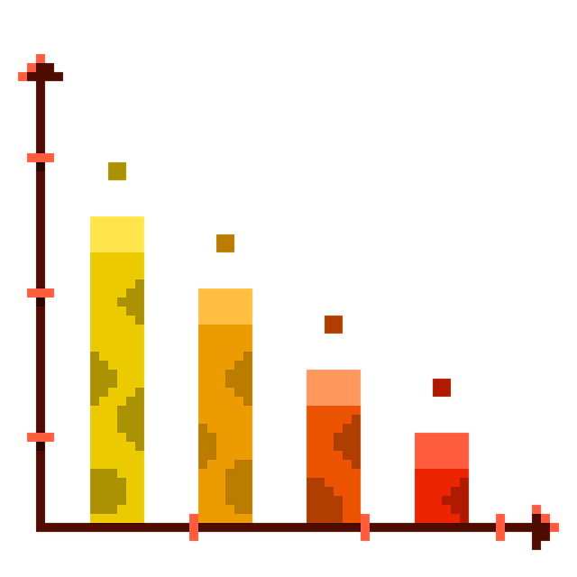

**_Sebastián Acosta Nieto_**

<picture>
 <source media="(prefers-color-scheme: dark)" srcset="Ultimación1.jpg">
 <source media="(prefers-color-scheme: light)" srcset="Ultimación1.jpg">
 
</picture>

*Hecho por mí.*

Soy científico de datos junior con mucho por aprender.

En este repositorio comparto mis proyectos personales de análisis y ciencia de datos 📈📉📊📋; descargar, procesar y visualizar datos sociales en el lenguaje de programación python (único lenguaje por el momento).

Sientanse libres de aportar todo lo que consideren necesario a mis proyectos, sé que tienen pueden mejorar y voy a aprender mucho gracias a todxs ustedes.

<picture>
 <source media="(prefers-color-scheme: dark)" srcset="bar-9342578_640.png">
 <source media="(prefers-color-scheme: light)" srcset="bar-9342578_640.png">
 
</picture>

##### Imagen de <a href="https://pixabay.com/es/users/pikurā-17746921/?utm_source=link-attribution&utm_medium=referral&utm_campaign=image&utm_content=9342578">Pikurā</a> en <a href="https://pixabay.com/es//?utm_source=link-attribution&utm_medium=referral&utm_campaign=image&utm_content=9342578">Pixabay</a>

<!--
**Dajovizgra/Dajovizgra** is a ✨ _special_ ✨ repository because its `README.md` (this file) appears on your GitHub profile.

Here are some ideas to get you started:

- 🔭 I’m currently working on ...
- 🌱 I’m currently learning ...
- 👯 I’m looking to collaborate on ...
- 🤔 I’m looking for help with ...
- 💬 Ask me about ...
- 📫 How to reach me: ...
- 😄 Pronouns: ...
- ⚡ Fun fact: ...
-->
